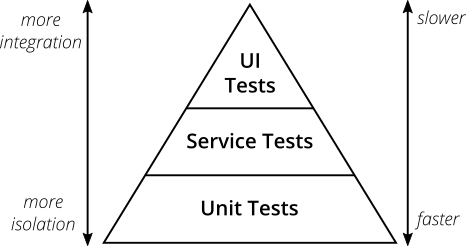

# Test e2e com Cypress

## 🚀 Tecnologias

- [Node.js] - plataforma de desenvolvimento
- [Cypress] - framework para automação de testes end-to-end
- [Javascript] - linguagem de programação

## 👨🏻‍💻 Como executar o projeto

[Node.js](https://nodejs.org/) v16 ou superior para executar.

Execute os comandos abaixo para instalar as dependências do projeto e execução dos testes:

Instalando Cypress via npm:
```
cd test-e2e-cypress
npm install
npm install cypress --save-dev
```

Instalando Cypress via yarn:
```
cd test-e2e-cypress
yarn install
yarn add cypress --dev
npm install cypress --save-dev
```

Para abrir o Cypress com npm ou yarn:
```
npx cypress open
ou
npx cypress open
```

Para executar os testes:
```
npx cypress run
ou
yarn cypress run
```

Camada na pirâmide de testes:

- UI Tests



```

